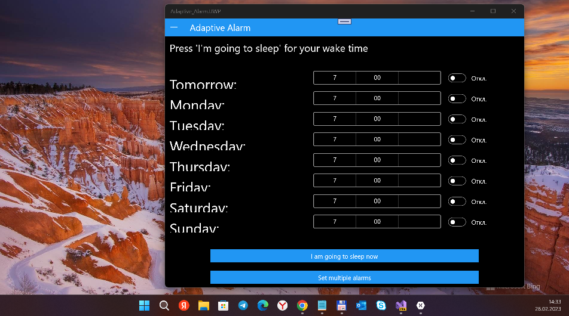
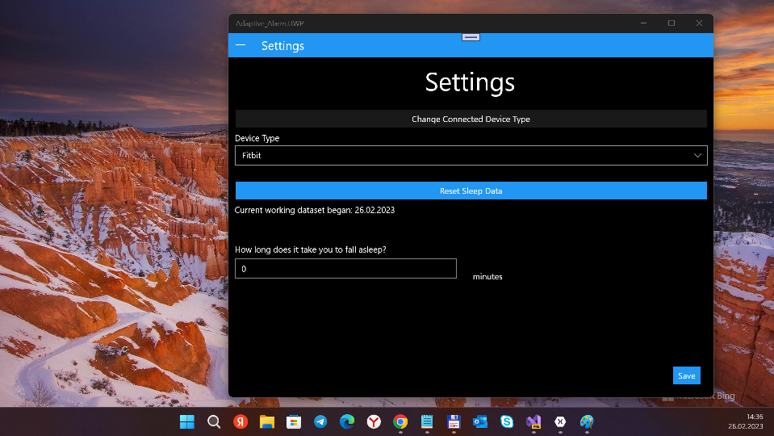
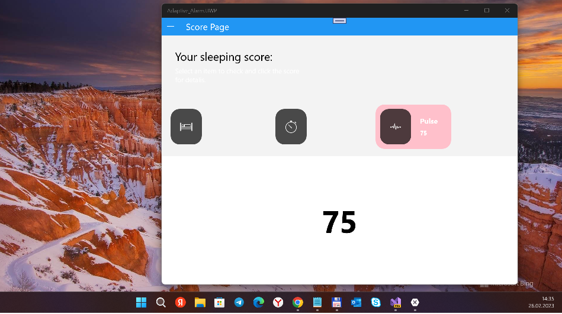

# FitBitAlarmX
This is my fork of [AdaptiveAlarm](https://github.com/johannesRidael/AdaptiveAlarm) 
solution based on XamarinForms "framework".

## Screenshots

## Idea
The original AdaptiveAlarm app supports only Android and iOS "targets".
I'm trying getting started with Fitbit's adaptive alarms in "XF UWP"...

## Few Tech details
- Xamarin Forms 5
- NET Standard 2.0
- Min. Win. os build = 16299

## Credits
[Johannes Ridael](https://github.com/johannesRidael) Original AdaptiveAlarm's developer

## ..
AS IS. No support. RnD only.

## .
[m][e] 2023
